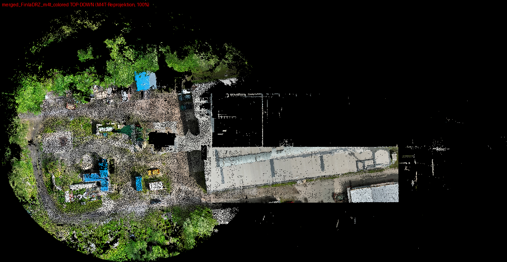
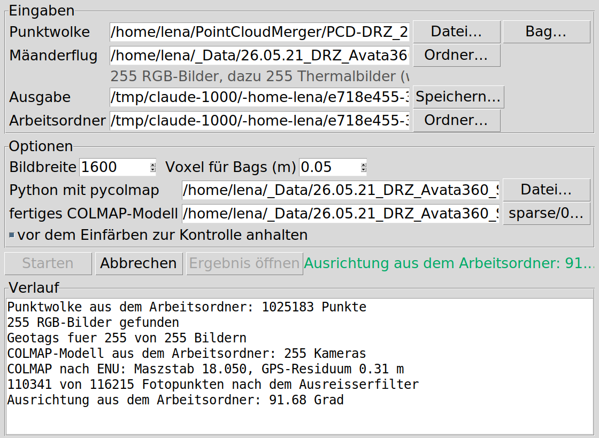
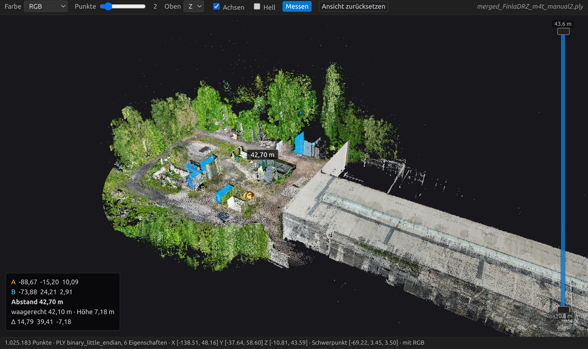

# PointCloudMerger

LiDAR-Punktwolke der Super-Drohne (Livox Mid360) mit den Luftbildern eines
Mäanderfluges der DJI Matrice 4T zusammenbringen und einfärben.

Die Daten stammen von einer DRZ-Mission am 20.05.2026. Geflogen wurden zwei
Plattformen unabhängig voneinander. Die Super-Drohne hat mit dem Mid360 und
FAST-LIO drei Teilkarten aufgenommen, welche danach von Hand zu
`merged_FinlaDRZ.pcd` zusammengesetzt wurden. Die M4T ist dieselbe Fläche als
Gebietsroute abgeflogen und hat dabei 255 Nadir-Bildpaare aus RGB und Thermal
mit RTK-Geotags aufgenommen.

Die LiDAR-Karte hat nur XYZ, keine Farbe, keine Intensität und keine
Georeferenz. Das Verfahren hier ist deshalb keine Verschmelzung zweier Wolken,
sondern eine Reprojektion. Jeder LiDAR-Punkt wird in die Luftbilder
zurückprojiziert und übernimmt die Farbe des getroffenen Pixels.

## Ergebnis

| Datei | Inhalt |
|---|---|
| `PCD-DRZ_20-05-26/merged_FinlaDRZ_m4t_manual2.ply` | 1.025.183 Punkte, **100 % eingefärbt**, RGB aus den M4T-Bildern |

Die Thermal-Variante und die Wolke mit echten Temperaturwerten in °C lassen
sich mit den Skripten aus denselben Eingangsdaten erzeugen, liegen aber wegen
der Dateigröße nicht im Repo.



## Warum der Umweg über COLMAP

Der LiDAR-Karte fehlt die Trajektorie. Der DRZ-Bag enthält zwar 6778
Kamerabilder, aber `/Odometry` und `/cloud_registered` sind leer, und die drei
Mid360-Aufnahmen wurden von Hand zusammengeschoben. Damit gibt es keine
Kamerapose im Kartenframe, über die man direkt projizieren könnte.

Der Weg führt deshalb über die M4T. Deren Bilder haben eigene Posen aus einer
COLMAP-Rekonstruktion, in der alle 255 Bilder registriert sind. Über die
RTK-Geotags wird der COLMAP-Frame per Umeyama-Similarity metrisch gemacht
(Residuum 0,31 m), und eine Handjustage in RViz bringt die Kameras in den
LiDAR-Frame. Danach ist die Projektion nur noch Rechnerei.

Transformationskette:

```
LiDAR-Punkt --inv(m4t_affine)--> COLMAP-Welt --[Rcw|tcw]--> Kamera --SIMPLE_RADIAL--> Pixel --> RGB
```

Je Punkt wird die Kamera mit dem kleinsten Bildradius genommen, also die am
weitesten nadirnahe. Verdeckung wird nicht behandelt, was bei Nadiraufnahme
und flachem Relief unkritisch ist.

## Der ganze Weg auf einen Knopf

Der Ablauf unten ist der Weg von Hand, so wie er 2026 gelaufen ist. Dasselbe
gibt es inzwischen als Pipeline mit kleiner Oberfläche in
[`colorize_pipeline/`](colorize_pipeline/README.md). Dort wählt man eine
Punktwolke, einen Ordner mit den Bildern des Fluges und bekommt die farbige
Wolke.

```bash
python3 -m colorize_pipeline.gui
```



Der Schritt, welcher früher von Hand in RViz lief, ist die Ausrichtung der
Kameras auf die LiDAR-Karte. Der läuft jetzt automatisch, weil zwischen dem
ENU-System und dem LiDAR-Rahmen eine **reine Drehung um die Hochachse** liegt,
die Restneigung ist exakt null. Beide Rahmen sind lotrecht, das ENU-System per
Definition und die SLAM-Karte über die IMU. Statt sieben Freiheitsgraden
bleiben vier, und die findet eine Kreuzkorrelation über Draufsichten plus ein
Feinschliff gegen das Höhenmodell des LiDAR.

Für den Datensatz hier kommt die Automatik auf 91,68 Grad gegenüber 92,513
Grad von Hand und färbt ebenfalls 100 % ein. Nachgemessen an der Farbstreuung
zwischen den Kameras an Höhenkanten liegt sie sogar leicht vorn. Wer trotzdem
nachziehen will, bekommt die Ausrichtung vor dem Einfärben als Draufsicht mit
vier Reglern vorgelegt.

## Ablauf von Hand

```bash
cd gaussian_splat_avata360

# 1. Kameraposen und Intrinsics aus dem COLMAP-Modell holen (braucht pycolmap)
python3 export_m4t_cameras.py                     # -> output/m4t_cameras.npz

# 2. Ausrichtung von Hand, M4T-Punkte über der LiDAR-Karte
python3 rviz_align_m4t.py                         # dazu rviz2 -d align_m4t.rviz
python3 save_m4t.py                               # -> output/m4t_affine.json

# 3. Reprojektion RGB
python3 project_m4t_color.py --affine=output/m4t_affine.json \
        --out=../PCD-DRZ_20-05-26/merged_FinlaDRZ_m4t_manual2.ply

# 4. Anschauen
python3 publish_colored.py ../PCD-DRZ_20-05-26/merged_FinlaDRZ_m4t_manual2.ply
rviz2 -d colored.rviz
```

Die Thermal- und Temperaturwolken laufen über `project_m4t_thermal.py` und
`make_temperature_cloud.py`. Letzteres braucht das DJI Thermal SDK, weil die
`_T.JPG` radiometrische R-JPEGs sind und die 16-Bit-Rohwerte erst über
`dji_irp` zu °C werden.

## Was nicht funktioniert hat

Der erste Versuch lief über ein Gaussian Splat aus dem Avata-360-Video. Die
automatische Registrierung Splat gegen LiDAR ist gescheitert, weil das Splat
eine radiale Photogrammetrie-Schüssel ist und das LiDAR ein Boden- und
Gebäudescan. Yaw-Multistart-ICP hat keinen Gewinner gezeigt, FPFH mit RANSAC
war instabil. Von Hand ausgerichtet kam die Wolke auf 34,9 % Einfärbung. Erst
die M4T-Reprojektion hat 100 % gebracht.

Die ICP-Verfeinerung der M4T-Ausrichtung sieht in der Metrik besser aus
(Farbstreuung 0,183 auf 0,158), ist aber visuell schlechter, weil sie an
Gebäudekanten verkippt. Die Metrik wird vom flachen Boden dominiert und ist
hier irreführend. `merged_FinlaDRZ_m4t_refined.ply` also nicht verwenden.

Die verworfenen Skripte liegen trotzdem im Repo, damit die Doku vollständig
bleibt.

## Wolken in VS Code anschauen

Im Ordner `vscode-pointcloud-viewer/` liegt eine kleine VS-Code-Extension,
welche `.pcd` und `.ply` direkt im Editor darstellt, statt die Datei als
Binärmüll zu öffnen. Sie liest PCD in `ascii`, `binary` und
`binary_compressed` sowie PLY in `ascii` und beiden Binärvarianten. Gefärbt
wird nach RGB, Höhe oder einem Skalarfeld wie `intensity`.

Dazu zwei Werkzeuge, welche beim Auswerten helfen. Die Leiste am rechten Rand
schneidet die Wolke in der Höhe, mit zwei Griffen wie bei einem Schichtmodell,
damit man ein Dach abnehmen und in ein Gebäude hineinschauen kann. Und mit
`Messen` lässt sich der Abstand zwischen zwei angeklickten Punkten bestimmen,
er steht in Metern an der Verbindungslinie.

```bash
ln -sfn "$PWD/vscode-pointcloud-viewer" \
        ~/.vscode/extensions/lenakremer.pointcloud-viewer-0.1.0
```

Danach VS Code neu starten. Näheres in
[vscode-pointcloud-viewer/README.md](vscode-pointcloud-viewer/README.md).



Zu sehen ist `merged_FinlaDRZ_m4t_manual2.ply`, also das Ergebnis dieser
Pipeline. Gemessen wird zwischen zwei Containern, 42,70 m.

## Struktur

```
docs/                               ausführliche Doku im MediaWiki-Format
  DRZ_Colorize_Pipeline.mediawiki   kompletter Weg inklusive Fehlversuchen
  M4T_Colorize.mediawiki            Kurzfassung der Reprojektion
  M4T_LiDAR_Combine_Detail.mediawiki  Detaildoku nur zur M4T-Kombination
colorize_pipeline/                  die Pipeline mit Oberfläche
gaussian_splat_avata360/            alle Skripte und RViz-Konfigurationen
  output/                           Transformationen, Kameraposen
  m4t_work/m4t_gps.json             RTK-Geotag je Bild
PCD-DRZ_20-05-26/                   Punktwolken
vscode-pointcloud-viewer/           VS-Code-Extension für .pcd und .ply
bilder/                             Renderings für die Doku
```

Der Ordnername `gaussian_splat_avata360` stammt noch aus dem Splat-Versuch. Er
ist so geblieben, weil die Doku ihn durchgehend nennt.

## Was fehlt

Die Rohdaten sind zu groß für das Repo und liegen unter
`~/_Data/26.05.21_DRZ_Avata360_Super360Pointcloud/`:

- `m4t/DCIM/…` die 255 RGB- und 255 Thermal-Bilder samt PPK-Dateien
- `gaussian_splat_avata360/m4t_work/images/` dieselben Bilder in 1600×1200,
  passend zu den COLMAP-Intrinsics, daraus wird gesampelt
- `gaussian_splat_avata360/m4t_work/sparse/0` das COLMAP-Modell
- die Splat-PLYs und die Videos

Ohne `m4t_work/images` und `m4t_work/sparse/0` laufen `export_m4t_cameras.py`
und `project_m4t_color.py` nicht. Die fertige Wolke liegt aber im Repo.

## Abhängigkeiten

Zwei getrennte Python-Umgebungen, weil sich die Pakete nicht vertragen. Das
venv hat pycolmap und gsplat, aber kein Open3D. Das System-Python hat Open3D
und ROS 2 Humble, aber kein pycolmap.

- NumPy, SciPy, Pillow
- pycolmap, nur für `export_m4t_cameras.py` und `export_m4t_points.py`
- Open3D 0.19 für Ausrichtung, Rendering und den Hover-Viewer
- ROS 2 Humble mit RViz2 für die Handjustage und die Anzeige
- DJI Thermal SDK, nur für echte Temperaturen
