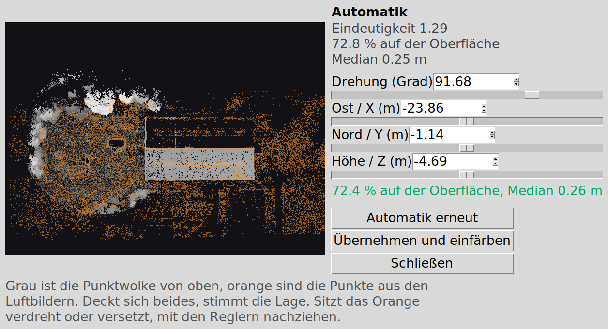

# Punktwolke mit einem Mäanderflug einfärben

Nimmt eine LiDAR-Punktwolke und einen Ordner mit den Bildern eines
Kartierungsfluges und macht daraus eine farbige Punktwolke. Der Weg von Hand
steht in [../docs/DRZ_Colorize_Pipeline.mediawiki](../docs/DRZ_Colorize_Pipeline.mediawiki),
hier ist er zusammengefasst und läuft ohne Eingriff durch.


## Starten

```bash
# mit Oberfläche
python3 -m colorize_pipeline.gui

# Pfade gleich mitgeben
python3 -m colorize_pipeline.gui wolke.pcd flugordner ergebnis.ply

# ohne Oberfläche
python3 -m colorize_pipeline.cli \
    --wolke PCD-DRZ_20-05-26/merged_FinlaDRZ.pcd \
    --flug  /pfad/DJI_202605201521_001_Gebietsroute-erstellen1 \
    --ziel  ergebnis.ply
```

## Was hineingeht

**Punktwolke**, entweder als `.pcd` (ascii, binary, binary_compressed), als
`.ply` oder als ROS-2-Bag. Beim Bag zeigt die Oberfläche die vorhandenen
PointCloud2-Themen zur Auswahl, `--themen-zeigen` tut dasselbe auf der
Kommandozeile. Die Wolke muss in einem gemeinsamen Rahmen liegen, also etwa
`/cloud_registered` oder `/Laser_map` aus einem SLAM-Lauf. Rohe Sensorwolken
ohne Trajektorie ergeben keine Karte.

**Flugordner** mit den Bildern. Gesucht werden die `_V.JPG` einer DJI-Mission,
sonst alle JPEGs außer den Thermalbildern `_T.JPG`. Jedes Bild braucht einen
Geotag. Bei DJI stehen Länge und Breite im EXIF und die Höhe als
`RelativeAltitude` im XMP-Block, beides liest die Pipeline mit `exiftool`
oder, falls das fehlt, selbst.

## Wie es rechnet

```
Bilder ──► COLMAP ──► Kameraposen im willkürlichen Rahmen
                          │
   RTK-Geotags ───────────┤ Umeyama          → Maßstab, metrisch in ENU
                          ▼
                      Fotopunkte in ENU
                          │
   LiDAR-Karte ───────────┤ Drehung um die Hochachse + Verschiebung
                          ▼
             ein Affin COLMAP → LiDAR-Rahmen
                          │
                          ▼
   jeder LiDAR-Punkt ──► in das nadirnächste Bild ──► RGB
```

Der Schritt, welcher früher von Hand lief, ist die Ausrichtung der Kameras auf
die LiDAR-Karte. Automatisierbar wird er durch eine Beobachtung am Datensatz
dieses Repos: **zwischen ENU und dem LiDAR-Rahmen liegt eine reine Drehung um
die Hochachse**, die Restneigung ist exakt null. Beide Rahmen sind lotrecht,
das ENU-System per Definition und die SLAM-Karte über die IMU. Damit bleiben
vier Freiheitsgrade statt sieben, und die lassen sich suchen.

**Grob**, in `register.coarse_yaw`: beide Wolken werden von oben zu einer
Höhenkarte gerastert. Für jeden Winkel in Zweigradschritten sucht eine
Kreuzkorrelation über die FFT die beste Verschiebung. Das kostet eine FFT je
Winkel, also gut zwei Sekunden für die volle Runde, und der Winkel fällt
deutlich heraus. Die Phasenkorrelation, sonst das übliche Werkzeug, ist hier
schlechter, weil die Überlappung nur teilweise ist.

**Fein**, in `register.fit_to_dsm`: die Fotopunkte einer Nadirbefliegung
liegen auf genau der Oberfläche, welche das LiDAR von oben sieht. Statt einer
Nachbarschaftssuche im Raum, die am Rauschen der Photogrammetriepunkte hängen
bleibt, wird der Höhenunterschied zum Rastermodell des LiDAR minimiert. Der
Kern `exp(-(r/sigma)^2)` zählt Punkte auf der Oberfläche und ignoriert
Ausreißer, sigma läuft in drei Stufen von 2 m auf 0,5 m herunter.

Ein Nachziehen mit ICP über alle sechs Freiheitsgrade wäre hier falsch. Es
verkippt an Gebäudekanten und zerstört die Lotrechte, welche man geschenkt
bekommt.

## Was dabei herauskommt

Gemessen am Datensatz `merged_FinlaDRZ.pcd` mit den 255 Bildern der M4T:

| | |
|---|---|
| COLMAP nach ENU | Maßstab 18,050, GPS-Residuum 0,31 m |
| Winkel automatisch | 91,68 Grad |
| Winkel von Hand (2026-05-25) | 92,513 Grad |
| Fotopunkte auf der LiDAR-Oberfläche | 72,8 % innerhalb 0,5 m, Median 0,25 m |
| Abweichung zur Handlösung | Median 1,02 m, 95 % bei 1,87 m |
| eingefärbt | 100,0 % |
| Laufzeit ohne Rekonstruktion | 68 s, davon 53 s für das Verkleinern der Bilder |

Die verbleibende Abweichung von einem Meter klingt nach viel, liegt aber in
der Größenordnung, in der eine Handausrichtung selbst schwankt. Objektiv
nachgemessen an der Farbstreuung zwischen den Kameras, beschränkt auf Punkte
an Höhenkanten, wo eine Fehlausrichtung durchschlägt, liegt die Automatik
sogar leicht vorn: 0,1400 gegen 0,1418. Beide Lösungen sind also gleich gut,
und die eine kostet keine Handarbeit.

## Wenn die Automatik danebenliegt

Vor dem Einfärben hält die Pipeline an und zeigt eine Draufsicht. Grau ist die
Punktwolke, orange sind die Fotopunkte nach der Ausrichtung. Deckt sich
beides, stimmt die Lage.



Vier Regler ziehen die Lage nach, Drehung und die drei Verschiebungen. Die
Kennzahl daneben sagt, wie viel Prozent der Fotopunkte auf der Oberfläche
liegen, und rechnet bei jeder Bewegung mit. Höher ist besser. `Automatik
erneut` rechnet die Suche noch einmal, `Übernehmen und einfärben` geht weiter.
Wer das Anhalten nicht will, nimmt den Haken in den Optionen heraus.

Die gefundene Lage steht als `align.json` im Arbeitsordner und wird beim
nächsten Lauf wiederverwendet. Zum Neurechnen die Datei löschen.

## Arbeitsordner

Jeder Schritt legt sein Ergebnis ab und wird beim nächsten Lauf übersprungen.

```
arbeit/
  cloud.npy      die eingelesene Punktwolke
  images/        die Bilder auf Arbeitsgröße, daraus wird gesampelt
  gps.json       Geotag je Bild
  sparse/0/      die COLMAP-Rekonstruktion
  cameras.npz    Posen, Intrinsics und die 3D-Punkte daraus
  align.json     die gefundene Ausrichtung
  affine.json    die ganze Kette als ein Affin COLMAP → LiDAR
```

## Voraussetzungen

Alles läuft im System-Python mit numpy, scipy und Pillow, dazu tkinter für die
Oberfläche. Nur die Rekonstruktion braucht **pycolmap**, und das steckt hier in
einem eigenen venv. Deshalb ruft `sfm.py` einen zweiten Interpreter als
Unterprozess auf. Die Oberfläche sucht ihn selbst und zeigt ihn an, ändern
lässt er sich im Feld darunter.

Ohne pycolmap läuft die Pipeline trotzdem, wenn man ein fertiges COLMAP-Modell
angibt, also den Ordner `sparse/0`. Für den Datensatz dieses Repos liegt eines
unter `~/_Data/26.05.21_DRZ_Avata360_Super360Pointcloud/gaussian_splat_avata360/m4t_work/sparse/0`.

`exiftool` ist keine Pflicht, macht das Lesen der Geotags aber schneller.

## Grenzen

Verdeckung wird nicht behandelt. Bei einer Nadirbefliegung über flachem Relief
ist das unkritisch, an einer hohen Wand kann ein Punkt die Farbe des Bodens
davor bekommen.

Die Annahme, dass beide Rahmen lotrecht sind, trägt die ganze Automatik. Bei
einer Karte ohne IMU-Stützung, etwa aus reiner Photogrammetrie, stimmt sie
nicht, und dann bleibt nur die Handausrichtung.

Das Thermalbild wird nicht mitverarbeitet. Der Weg dahin steht in
[../docs/DRZ_Colorize_Pipeline.mediawiki](../docs/DRZ_Colorize_Pipeline.mediawiki),
er braucht zusätzlich das DJI Thermal SDK für die Umrechnung in Grad.
